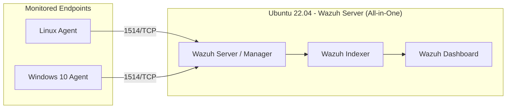

# Wazuh Installation Guide (Beginner Friendly)

A complete, beginner-friendly walkthrough for installing **Wazuh** — a free,
open-source security monitoring platform (SIEM + XDR) — from scratch. This
guide covers installing the **Wazuh server** (all-in-one) and connecting
**agents** from both Linux and Windows machines.

> 💡 **New to Wazuh?** Think of it as three components working together:
> - **Wazuh Indexer** – stores all the security data (built on OpenSearch)
> - **Wazuh Server** – analyzes data, applies rules, and generates alerts
> - **Wazuh Dashboard** – the web interface where you view everything
>
> The "all-in-one" install puts all three on a single Ubuntu machine, which
> is the easiest way to get started in a home lab or test environment.

---

## Table of Contents
1. [What You'll Need](#1-what-youll-need)
2. [Lab Architecture](#2-lab-architecture)
3. [Installing the Wazuh Server (All-in-One)](#3-installing-the-wazuh-server-all-in-one)
4. [Logging Into the Dashboard](#4-logging-into-the-dashboard)
5. [Installing the Wazuh Agent on Linux](#5-installing-the-wazuh-agent-on-linux)
6. [Installing the Wazuh Agent on Windows 10](#6-installing-the-wazuh-agent-on-windows-10)
7. [Verifying Agents Are Connected](#7-verifying-agents-are-connected)
8. [Basic Post-Install Configuration](#8-basic-post-install-configuration)
9. [Troubleshooting](#9-troubleshooting)
10. [References](#10-references)

---

## 1. What You'll Need

| Requirement | Minimum Spec |
|---|---|
| OS for Wazuh server | Ubuntu 22.04 LTS (64-bit) |
| RAM | 4 GB minimum (8 GB recommended) |
| Disk space | 50 GB+ |
| CPU | 2 cores minimum |
| Network | Static IP recommended for the server |
| Access | `sudo`/root access on all machines |

You'll also need at least one extra machine to install an **agent** on —
this can be another Linux VM, a Windows 10 PC, or both.

---

## 2. Lab Architecture



| Component | Role | IP (example) |
|---|---|---|
| Wazuh Server | Indexer + Manager + Dashboard | `192.168.1.10` |
| Linux Agent | Monitored endpoint | `192.168.1.20` |
| Windows 10 Agent | Monitored endpoint | `192.168.1.30` |

---

## 3. Installing the Wazuh Server (All-in-One)

### 3.1 Update Your System
Always start with an updated system — this avoids dependency errors later.
```bash
sudo apt update && sudo apt upgrade -y
```

### 3.2 Download the Installation Assistant
Wazuh provides a single script that installs the indexer, server, and
dashboard together, and generates passwords for you automatically.
```bash
curl -sO https://packages.wazuh.com/4.9/wazuh-install.sh
```

> 🔎 **Check the version number** at [wazuh.com/downloads](https://wazuh.com/downloads/)
> before running this — the guide uses `4.9` as an example, but you should
> use the current stable release.

### 3.3 Run the Installer
```bash
sudo bash wazuh-install.sh -a
```
The `-a` flag tells the script to install **all three components** on this
one machine. This step takes several minutes — grab a coffee ☕.

### 3.4 Save Your Admin Credentials
When the install finishes, it prints a block of auto-generated passwords,
including one for the `admin` dashboard user. **Copy this somewhere safe —
it will not be shown again automatically.**

If you missed it, you can retrieve the passwords with:
```bash
sudo tar -xvf wazuh-install-files.tar
sudo cat wazuh-install-files/wazuh-passwords.txt
```

### 3.5 Confirm the Services Are Running
```bash
sudo systemctl status wazuh-manager
sudo systemctl status wazuh-indexer
sudo systemctl status wazuh-dashboard
```
Each should show `active (running)` in green. If any show `failed`, jump to
the [Troubleshooting](#9-troubleshooting) section.

### 3.6 Open the Firewall
```bash
sudo ufw allow 443/tcp     # Dashboard (HTTPS)
sudo ufw allow 1514/tcp    # Agent data
sudo ufw allow 1515/tcp    # Agent enrollment
sudo ufw allow 55000/tcp   # Wazuh API
```

---

## 4. Logging Into the Dashboard

1. Open a browser and go to:
   ```
   https://192.168.1.10
   ```
   (Replace with your server's actual IP.)
2. Your browser will warn about a self-signed certificate — this is
   expected in a lab setup. Click **Advanced → Proceed**.
3. Log in with:
   - **Username:** `admin`
   - **Password:** the one you saved in step 3.4
4. You should land on the Wazuh **Dashboard home page**, currently empty
   since no agents are connected yet.

---

## 5. Installing the Wazuh Agent on Linux

Run these commands **on the Linux machine you want to monitor** (not the
Wazuh server, unless you also want to monitor the server itself).

### 5.1 Add the Wazuh Repository
```bash
curl -s https://packages.wazuh.com/key/GPG-KEY-WAZUH | sudo gpg --no-default-keyring --keyring gnupg-ring:/usr/share/keyrings/wazuh.gpg --import && sudo chmod 644 /usr/share/keyrings/wazuh.gpg
echo "deb [signed-by=/usr/share/keyrings/wazuh.gpg] https://packages.wazuh.com/4.x/apt/ stable main" | sudo tee /etc/apt/sources.list.d/wazuh.list
sudo apt update
```

### 5.2 Install the Agent
```bash
sudo WAZUH_MANAGER='192.168.1.10' apt install wazuh-agent -y
```
Replace `192.168.1.10` with your Wazuh server's IP — this tells the agent
where to send its data.

### 5.3 Start the Agent
```bash
sudo systemctl daemon-reload
sudo systemctl enable wazuh-agent
sudo systemctl start wazuh-agent
sudo systemctl status wazuh-agent
```

---

## 6. Installing the Wazuh Agent on Windows 10

### 6.1 Download the Agent
Download the `.msi` installer from
[wazuh.com/downloads](https://wazuh.com/downloads/) (choose the Windows
package matching your Wazuh server version).

### 6.2 Install via PowerShell (Recommended)
Run PowerShell **as Administrator**:
```powershell
Invoke-WebRequest -Uri https://packages.wazuh.com/4.x/windows/wazuh-agent-4.9.0-1.msi -OutFile $env:tmp\wazuh-agent.msi
msiexec.exe /i $env:tmp\wazuh-agent.msi /q WAZUH_MANAGER='192.168.1.10'
```
Replace the version number and `WAZUH_MANAGER` IP with your own values.

### 6.3 Start the Agent Service
```powershell
NET START WazuhSvc
```

### 6.4 Confirm It's Running
```powershell
Get-Service -Name WazuhSvc
```
Status should show `Running`.

---

## 7. Verifying Agents Are Connected

1. On the Wazuh server, list connected agents:
   ```bash
   sudo /var/ossec/bin/agent_control -l
   ```
2. In the Dashboard, go to **Agents** (left sidebar) — your Linux and
   Windows machines should appear with a green **Active** status.
3. Click into an agent to see its details: OS info, last check-in time, and
   any policy/inventory data being collected.

If an agent shows as **Never Connected** or **Disconnected**, see
[Troubleshooting](#9-troubleshooting).

---

## 8. Basic Post-Install Configuration

These are a few beginner-friendly tweaks worth making early on.

### 8.1 Enable File Integrity Monitoring (FIM)
On the **agent**, edit `/var/ossec/etc/ossec.conf` (Linux) or
`C:\Program Files (x86)\ossec-agent\ossec.conf` (Windows) and add
directories to watch inside the `<syscheck>` block:
```xml
<syscheck>
  <directories check_all="yes" report_changes="yes">/etc,/usr/bin,/usr/sbin</directories>
</syscheck>
```
Restart the agent afterward for changes to take effect.

### 8.2 View Alerts
In the Dashboard, go to **Threat Hunting** to see real-time alerts as they
come in from all agents — this is the main screen you'll use day to day.

### 8.3 Enable Vulnerability Detection (Optional but Useful)
On the manager, in `/var/ossec/etc/ossec.conf`, confirm the
`<vulnerability-detection>` block is enabled — this scans installed
software on agents against known CVEs.
```bash
sudo systemctl restart wazuh-manager
```

---

## 9. Troubleshooting

| Symptom | Likely Cause | Fix |
|---|---|---|
| Can't reach the dashboard at `https://<ip>` | Firewall blocking port 443 | Check `ufw status`; allow port 443 |
| Installer fails partway through | Low RAM/disk, or ran without `sudo` | Re-run with `sudo`; ensure 4 GB+ RAM free |
| Agent shows "Never Connected" | Wrong `WAZUH_MANAGER` IP, or port 1514/1515 blocked | Re-check IP; open ports on server firewall |
| Forgot admin dashboard password | Password file not saved | Extract `wazuh-install-files.tar` again (see §3.4) |
| `wazuh-indexer` fails to start | Not enough memory allocated | Increase VM RAM to at least 4 GB |
| Windows agent won't start | Wrong manager IP passed at install | Reinstall with the correct `WAZUH_MANAGER` value |

---

## 10. References
- [Official Wazuh Documentation](https://documentation.wazuh.com/)
- [Wazuh Quickstart Guide](https://documentation.wazuh.com/current/quickstart.html)
- [Wazuh Downloads](https://wazuh.com/downloads/)
- [Wazuh Agent Enrollment Guide](https://documentation.wazuh.com/current/user-manual/agent/agent-enrollment/index.html)

---

Aigbokhaode Hope Imomoh
