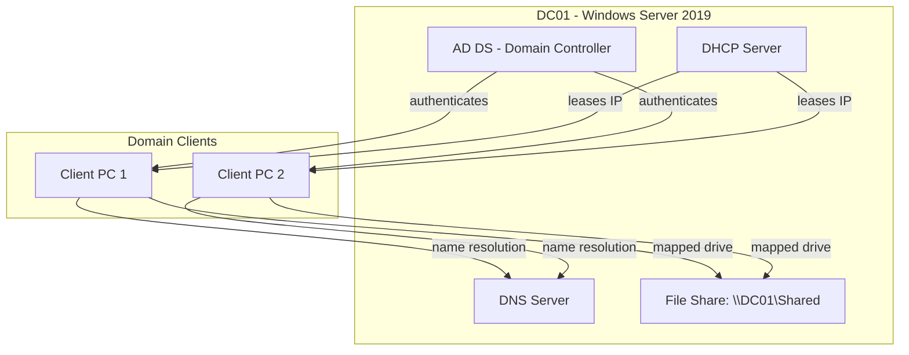

# Windows Server 2019: Active Directory, DNS & DHCP — Full Deployment Guide

A detailed, end-to-end guide for standing up a Windows Server 2019 domain
environment from scratch: **Active Directory Domain Services (AD DS)**,
**Organizational Units (OUs)**, **security groups**, **users**, **Group
Policy Objects (GPOs)**, **shared folder permissions**, **DNS** (forward and
reverse lookup zones), and **DHCP**.

Every major step includes both the **GUI method** (Server Manager / MMC
snap-ins) and the equivalent **PowerShell** commands, so you can follow
along however you prefer — or automate it later.

---

## Table of Contents
1. [Lab Architecture](#1-lab-architecture)
2. [Prerequisites](#2-prerequisites)
3. [Installing Active Directory Domain Services](#3-installing-active-directory-domain-services)
4. [Promoting the Server to a Domain Controller](#4-promoting-the-server-to-a-domain-controller)
5. [Verifying the Domain Controller](#5-verifying-the-domain-controller)
6. [Creating Organizational Units (OUs)](#6-creating-organizational-units-ous)
7. [Creating Security Groups](#7-creating-security-groups)
8. [Creating Users](#8-creating-users)
9. [Group Policy Objects (GPOs)](#9-group-policy-objects-gpos)
10. [Shared Folders & Permissions](#10-shared-folders--permissions)
11. [DNS Server — Forward Lookup Zones](#11-dns-server--forward-lookup-zones)
12. [DNS Server — Reverse Lookup Zones](#12-dns-server--reverse-lookup-zones)
13. [DHCP Server Installation & Configuration](#13-dhcp-server-installation--configuration)
14. [End-to-End Verification](#14-end-to-end-verification)
15. [Troubleshooting](#15-troubleshooting)
16. [References](#16-references)

---

## 1. Lab Architecture



| Component | Value (example) |
|---|---|
| Domain name | `corp.local` |
| NetBIOS name | `CORP` |
| Domain Controller | `DC01` — `192.168.1.10` |
| Subnet | `192.168.1.0/24` |
| DHCP scope | `192.168.1.100` – `192.168.1.200` |

> ⚠️ Everything below assumes `DC01` has a **static IP address** already
> configured, and that its own DNS is pointed at **itself** (`127.0.0.1` or
> its own static IP) — this is mandatory before promoting to a domain
> controller.

---

## 2. Prerequisites

| Requirement | Details |
|---|---|
| OS | Windows Server 2019 (Standard or Datacenter, Desktop Experience recommended for beginners) |
| Static IP | Required — DNS and AD DS both depend on a stable address |
| Hostname | Set a permanent hostname before promotion (renaming a DC later is painful) |
| RAM/Disk | 4 GB+ RAM, 40 GB+ disk for a lab DC |
| Administrator access | Local admin on the server |

### 2.1 Set a Static IP (if not already done)
```powershell
New-NetIPAddress -InterfaceAlias "Ethernet" -IPAddress 192.168.1.10 -PrefixLength 24 -DefaultGateway 192.168.1.1
Set-DnsClientServerAddress -InterfaceAlias "Ethernet" -ServerAddresses 127.0.0.1
```

### 2.2 Set the Hostname
```powershell
Rename-Computer -NewName "DC01" -Restart
```

---

## 3. Installing Active Directory Domain Services

### GUI Method
1. Open **Server Manager → Manage → Add Roles and Features**.
2. Click **Next** through **Before You Begin**, **Installation Type**
   (Role-based), and **Server Selection**.
3. On **Server Roles**, check **Active Directory Domain Services**.
4. Click **Add Features** when prompted (installs required management tools).
5. Click **Next** through **Features** and **AD DS** info page.
6. On **Confirmation**, click **Install**.

### PowerShell Method
```powershell
Install-WindowsFeature -Name AD-Domain-Services -IncludeManagementTools
```

---

## 4. Promoting the Server to a Domain Controller

### GUI Method
1. After the role install finishes, click the **flag notification** in
   Server Manager → **Promote this server to a domain controller**.
2. Select **Add a new forest**, enter your root domain name (e.g.
   `corp.local`), click **Next**.
3. On **Domain Controller Options**:
   - Set the **Forest/Domain functional level** (Windows Server 2016 is a
     safe default for compatibility).
   - Ensure **DNS Server** is checked (it should be, by default).
   - Set a **Directory Services Restore Mode (DSRM) password** — this is
     separate from the Administrator password; write it down somewhere
     safe.
4. Click through **DNS Options** (ignore the delegation warning in a lab),
   **Additional Options** (NetBIOS name auto-fills, e.g. `CORP`), **Paths**
   (default is fine), and **Review Options**.
5. Click **Install**. The server will reboot automatically.

### PowerShell Method
```powershell
Install-ADDSForest `
  -DomainName "corp.local" `
  -DomainNetbiosName "CORP" `
  -InstallDNS `
  -SafeModeAdministratorPassword (ConvertTo-SecureString "P@ssw0rd123!" -AsPlainText -Force) `
  -Force
```
The server reboots automatically once promotion completes.

---

## 5. Verifying the Domain Controller

After reboot, log in as `CORP\Administrator` (note the domain prefix has
changed) and confirm:

```powershell
Get-ADDomain
Get-ADForest
dcdiag /v
```
- `Get-ADDomain` should show `corp.local` with `DC01` as a domain controller.
- `dcdiag /v` runs a full health check — look for `passed test` on each line.

---

## 6. Creating Organizational Units (OUs)

OUs are containers used to organize users, groups, and computers — and to
target Group Policy at specific parts of the business.

### Example OU Structure
```
corp.local
├── OU=HQ
│   ├── OU=Sales
│   ├── OU=IT
│   └── OU=HR
└── OU=ServiceAccounts
```

### GUI Method
1. Open **Active Directory Users and Computers** (`dsa.msc`).
2. Right-click the domain (`corp.local`) → **New → Organizational Unit**.
3. Name it (e.g. `HQ`), leave **Protect container from accidental
   deletion** checked, click **OK**.
4. Right-click the new `HQ` OU → **New → Organizational Unit** to nest
   `Sales`, `IT`, and `HR` inside it.

### PowerShell Method
```powershell
New-ADOrganizationalUnit -Name "HQ" -Path "DC=corp,DC=local"
New-ADOrganizationalUnit -Name "Sales" -Path "OU=HQ,DC=corp,DC=local"
New-ADOrganizationalUnit -Name "IT" -Path "OU=HQ,DC=corp,DC=local"
New-ADOrganizationalUnit -Name "HR" -Path "OU=HQ,DC=corp,DC=local"
New-ADOrganizationalUnit -Name "ServiceAccounts" -Path "DC=corp,DC=local"
```

---

## 7. Creating Security Groups

Groups control access to resources (shares, GPOs, applications) without
managing permissions per-user.

### GUI Method
1. In **Active Directory Users and Computers**, right-click the `IT` OU →
   **New → Group**.
2. Name it `GG-IT-Staff`, set **Group scope** to **Global**, **Group type**
   to **Security**, click **OK**.
3. Repeat for `GG-Sales-Staff` and `GG-HR-Staff` in their respective OUs.

### PowerShell Method
```powershell
New-ADGroup -Name "GG-IT-Staff" -GroupScope Global -GroupCategory Security -Path "OU=IT,OU=HQ,DC=corp,DC=local"
New-ADGroup -Name "GG-Sales-Staff" -GroupScope Global -GroupCategory Security -Path "OU=Sales,OU=HQ,DC=corp,DC=local"
New-ADGroup -Name "GG-HR-Staff" -GroupScope Global -GroupCategory Security -Path "OU=HR,OU=HQ,DC=corp,DC=local"
```

> 💡 **Naming convention tip:** prefixing groups (`GG-` for Global Group)
> makes large environments far easier to audit later.

---

## 8. Creating Users

### GUI Method
1. Right-click the `IT` OU → **New → User**.
2. Fill in **First name**, **Last name**, and **User logon name** (e.g.
   `jdoe`).
3. Set a temporary password, check **User must change password at next
   logon**, click **Next → Finish**.
4. Double-click the new user → **Member Of** tab → **Add** → type
   `GG-IT-Staff` → **OK**.

### PowerShell Method
```powershell
New-ADUser -Name "John Doe" `
  -GivenName "John" -Surname "Doe" `
  -SamAccountName "jdoe" `
  -UserPrincipalName "jdoe@corp.local" `
  -Path "OU=IT,OU=HQ,DC=corp,DC=local" `
  -AccountPassword (ConvertTo-SecureString "Temp@Pass123!" -AsPlainText -Force) `
  -ChangePasswordAtLogon $true `
  -Enabled $true

Add-ADGroupMember -Identity "GG-IT-Staff" -Members "jdoe"
```

### Bulk-Creating Users from a CSV (Sophisticated Option)
Create `users.csv`:
```csv
FirstName,LastName,SamAccountName,OU,Group
Jane,Smith,jsmith,"OU=Sales,OU=HQ,DC=corp,DC=local",GG-Sales-Staff
Mike,Brown,mbrown,"OU=HR,OU=HQ,DC=corp,DC=local",GG-HR-Staff
```
Then run:
```powershell
Import-Csv .\users.csv | ForEach-Object {
    New-ADUser -Name "$($_.FirstName) $($_.LastName)" `
      -GivenName $_.FirstName -Surname $_.LastName `
      -SamAccountName $_.SamAccountName `
      -UserPrincipalName "$($_.SamAccountName)@corp.local" `
      -Path $_.OU `
      -AccountPassword (ConvertTo-SecureString "Temp@Pass123!" -AsPlainText -Force) `
      -ChangePasswordAtLogon $true -Enabled $true
    Add-ADGroupMember -Identity $_.Group -Members $_.SamAccountName
}
```

---

## 9. Group Policy Objects (GPOs)

GPOs push configuration and security settings to users/computers within an
OU automatically.

### 9.1 Example: Password Policy for the IT OU

**GUI Method**
1. Open **Group Policy Management** (`gpmc.msc`).
2. Right-click the `IT` OU → **Create a GPO in this domain, and Link it here**.
3. Name it `GPO-IT-PasswordPolicy` → **OK**.
4. Right-click it → **Edit**.
5. Navigate to **Computer Configuration → Policies → Windows Settings →
   Security Settings → Account Policies → Password Policy**.
6. Set **Minimum password length** to `12`, **Maximum password age** to
   `60 days`.
7. Close the editor — settings apply automatically on the next policy
   refresh (or force it, see §9.3).

**PowerShell Method**
```powershell
New-GPO -Name "GPO-IT-PasswordPolicy" | New-GPLink -Target "OU=IT,OU=HQ,DC=corp,DC=local"
```
(Fine-grained password settings via PowerShell typically use **Fine-Grained
Password Policies** instead — see §9.4.)

### 9.2 Example: Map a Network Drive via GPO
1. Edit a GPO → **User Configuration → Preferences → Windows Settings →
   Drive Maps**.
2. Right-click → **New → Mapped Drive**.
3. Set **Location** to `\\DC01\Shared`, **Drive letter** to `S:`, **Action**
   to `Create`.

### 9.3 Force a Group Policy Update
On a client (or the DC), run:
```powershell
gpupdate /force
```

### 9.4 Fine-Grained Password Policies (Advanced)
Allows different password rules per group instead of one domain-wide policy:
```powershell
New-ADFineGrainedPasswordPolicy -Name "IT-StrictPolicy" `
  -Precedence 10 `
  -MinPasswordLength 14 `
  -PasswordHistoryCount 24 `
  -MaxPasswordAge "30.00:00:00" `
  -ComplexityEnabled $true

Add-ADFineGrainedPasswordPolicySubject -Identity "IT-StrictPolicy" -Subjects "GG-IT-Staff"
```

---

## 10. Shared Folders & Permissions

Windows file sharing uses **two layers** of permissions that combine —
**Share permissions** (network-level) and **NTFS permissions**
(filesystem-level). The **most restrictive combination always wins**.

### 10.1 Create the Folder and Share

**GUI Method**
1. Create a folder, e.g. `D:\Shared`.
2. Right-click it → **Properties → Sharing tab → Advanced Sharing**.
3. Check **Share this folder**, name the share `Shared`, click
   **Permissions**.
4. Remove `Everyone`, add `GG-IT-Staff` with **Change** and **Read** allowed.

**PowerShell Method**
```powershell
New-Item -Path "D:\Shared" -ItemType Directory
New-SmbShare -Name "Shared" -Path "D:\Shared" -FullAccess "CORP\GG-IT-Staff"
```

### 10.2 Set NTFS Permissions
**GUI Method**
1. Right-click `D:\Shared` → **Properties → Security tab → Edit**.
2. **Add** → `GG-IT-Staff` → grant **Modify**, **Read & Execute**, **List
   Folder Contents**, **Read**, **Write**.
3. Remove or restrict `Users`/`Everyone` as appropriate.

**PowerShell Method**
```powershell
$acl = Get-Acl "D:\Shared"
$rule = New-Object System.Security.AccessControl.FileSystemAccessRule("CORP\GG-IT-Staff","Modify","ContainerInherit,ObjectInherit","None","Allow")
$acl.SetAccessRule($rule)
Set-Acl "D:\Shared" $acl
```

### 10.3 Recommended Permission Model

| Layer | Setting | Reasoning |
|---|---|---|
| Share permission | `Authenticated Users` – **Full Control** | Simplifies management |
| NTFS permission | Specific groups only, tailored per folder | Actual access control lives here |

> 💡 This "wide share, tight NTFS" model is the standard best practice — it
> avoids maintaining permissions in two places.

### 10.4 Test Access
From a domain-joined client, logged in as a member of `GG-IT-Staff`:
```powershell
net use S: \\DC01\Shared
```

---

## 11. DNS Server — Forward Lookup Zones

A **forward lookup zone** resolves hostnames → IP addresses (e.g.
`dc01.corp.local` → `192.168.1.10`). This was created automatically during
AD DS promotion, but here's how to manage/verify it.

### GUI Method
1. Open **DNS Manager** (`dnsmgmt.msc`).
2. Expand **DC01 → Forward Lookup Zones** — you should already see
   `corp.local`, created automatically.
3. To add a manual record: right-click `corp.local` → **New Host (A or
   AAAA)**.
4. Enter a name (e.g. `fileserver`) and IP (e.g. `192.168.1.20`), click
   **Add Host**.

### PowerShell Method
```powershell
Get-DnsServerZone
Add-DnsServerResourceRecordA -ZoneName "corp.local" -Name "fileserver" -IPv4Address "192.168.1.20"
```

### Verify Resolution
```powershell
Resolve-DnsName fileserver.corp.local
```

---

## 12. DNS Server — Reverse Lookup Zones

A **reverse lookup zone** does the opposite — IP → hostname — used for
logging, troubleshooting, and some authentication protocols.

### GUI Method
1. In **DNS Manager**, right-click **Reverse Lookup Zones → New Zone**.
2. Choose **Primary zone**, **To all DNS servers running on domain
   controllers in this domain** (for AD-integrated replication).
3. Select **IPv4 Reverse Lookup Zone**.
4. Enter the **Network ID**: `192.168.1` (for a `/24` subnet).
5. Choose **Allow only secure dynamic updates** (recommended in an AD
   environment).
6. Finish the wizard.

### PowerShell Method
```powershell
Add-DnsServerPrimaryZone -NetworkID "192.168.1.0/24" -ReplicationScope "Forest" -DynamicUpdate "Secure"
```

### Add a PTR Record
Reverse zones populate automatically for records created with "Create
associated pointer (PTR) record" checked, or manually:
```powershell
Add-DnsServerResourceRecordPtr -ZoneName "1.168.192.in-addr.arpa" -Name "20" -PtrDomainName "fileserver.corp.local"
```

### Verify Reverse Resolution
```powershell
Resolve-DnsName 192.168.1.20
```

---

## 13. DHCP Server Installation & Configuration

### 13.1 Install the DHCP Role

**GUI Method**
1. **Server Manager → Add Roles and Features → Server Roles → DHCP
   Server** → **Next → Install**.

**PowerShell Method**
```powershell
Install-WindowsFeature -Name DHCP -IncludeManagementTools
```

### 13.2 Authorize the DHCP Server in AD
DHCP servers must be authorized in Active Directory before they'll respond
to client requests.
```powershell
Add-DhcpServerInDC -DnsName "dc01.corp.local" -IPAddress 192.168.1.10
```

### 13.3 Create a Scope

**GUI Method**
1. Open **DHCP** console (`dhcpmgmt.msc`).
2. Right-click **IPv4 → New Scope** → follow the wizard:
   - **Name:** `HQ-LAN`
   - **Start IP:** `192.168.1.100`
   - **End IP:** `192.168.1.200`
   - **Subnet mask:** `255.255.255.0`
   - **Default gateway:** `192.168.1.1`
   - **DNS server:** `192.168.1.10`
   - **Lease duration:** default (8 days) is fine for most labs
3. Activate the scope when prompted.

**PowerShell Method**
```powershell
Add-DhcpServerv4Scope -Name "HQ-LAN" `
  -StartRange 192.168.1.100 -EndRange 192.168.1.200 `
  -SubnetMask 255.255.255.0 -State Active

Set-DhcpServerv4OptionValue -ScopeId 192.168.1.0 -DnsServer 192.168.1.10 -Router 192.168.1.1
```

### 13.4 Create a Reservation (Optional)
Useful for servers/printers that should always get the same IP:
```powershell
Add-DhcpServerv4Reservation -ScopeId 192.168.1.0 -IPAddress 192.168.1.50 -ClientId "00-15-5D-01-02-03" -Description "Print Server"
```

### 13.5 Verify DHCP Is Leasing Addresses
```powershell
Get-DhcpServerv4Lease -ScopeId 192.168.1.0
```
On a client, run `ipconfig /release` then `ipconfig /renew` and confirm it
receives an address in the `192.168.1.100–200` range.

---

## 14. End-to-End Verification

Run through this checklist after completing all sections:

| Check | Command | Expected Result |
|---|---|---|
| Domain is up | `Get-ADDomain` | Returns `corp.local` details |
| DC health | `dcdiag /v` | All tests show `passed` |
| OU structure | `Get-ADOrganizationalUnit -Filter *` | Lists `HQ`, `Sales`, `IT`, `HR` |
| Groups exist | `Get-ADGroup -Filter *` | Lists `GG-IT-Staff`, etc. |
| Users exist | `Get-ADUser -Filter *` | Lists created users |
| GPO applied | `gpresult /r` (on client) | Shows linked GPOs |
| Share reachable | `net use S: \\DC01\Shared` | Maps successfully |
| Forward DNS | `Resolve-DnsName fileserver.corp.local` | Returns correct IP |
| Reverse DNS | `Resolve-DnsName 192.168.1.20` | Returns correct hostname |
| DHCP leasing | `ipconfig /renew` on client | Receives IP in scope range |

---

## 15. Troubleshooting

| Symptom | Likely Cause | Fix |
|---|---|---|
| Promotion to DC fails | DNS not pointed at itself, or no static IP | Re-check §2.1 network config |
| Users can't log in with new accounts | "Change password at next logon" not completed, or account disabled | Log in once to reset password, or check `Enabled` flag |
| GPO not applying | Not linked to correct OU, or not refreshed | Confirm link scope in `gpmc.msc`; run `gpupdate /force` |
| Client can't access share | NTFS permissions block access despite share allowing it | Remember: most restrictive of Share vs NTFS wins |
| Reverse lookups return nothing | Reverse zone missing, or PTR not created | Verify zone in §12; manually add PTR record |
| DHCP not leasing addresses | Server not authorized in AD | Run `Add-DhcpServerInDC` (§13.2) |
| Clients get APIPA (`169.254.x.x`) addresses | DHCP scope not activated, or scope exhausted | Check scope status in `dhcpmgmt.msc`; expand range if full |

---

## 16. References
- [Microsoft Docs: AD DS Deployment](https://learn.microsoft.com/en-us/windows-server/identity/ad-ds/deploy/ad-ds-deployment)
- [Microsoft Docs: Group Policy](https://learn.microsoft.com/en-us/windows-server/identity/ad-ds/manage/group-policy/group-policy-overview)
- [Microsoft Docs: DNS Server](https://learn.microsoft.com/en-us/windows-server/networking/dns/dns-top)
- [Microsoft Docs: DHCP Server](https://learn.microsoft.com/en-us/windows-server/networking/technologies/dhcp/dhcp-top)
- [Microsoft Docs: File Server and Share Permissions](https://learn.microsoft.com/en-us/windows-server/storage/file-server/file-server-smb-overview)

---

Aigbokhaode Hope Imomoh
